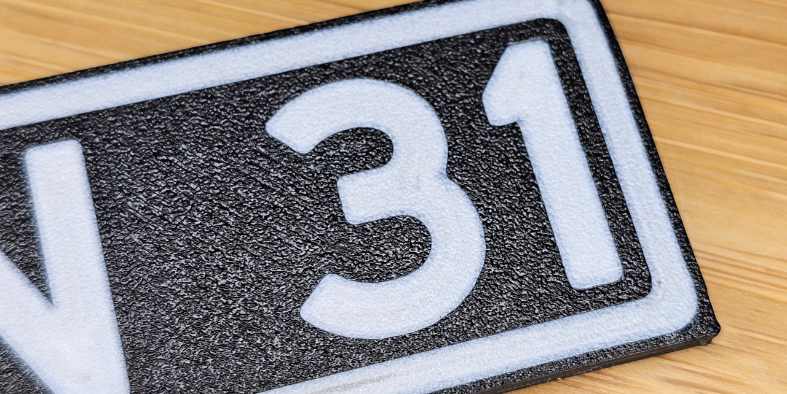
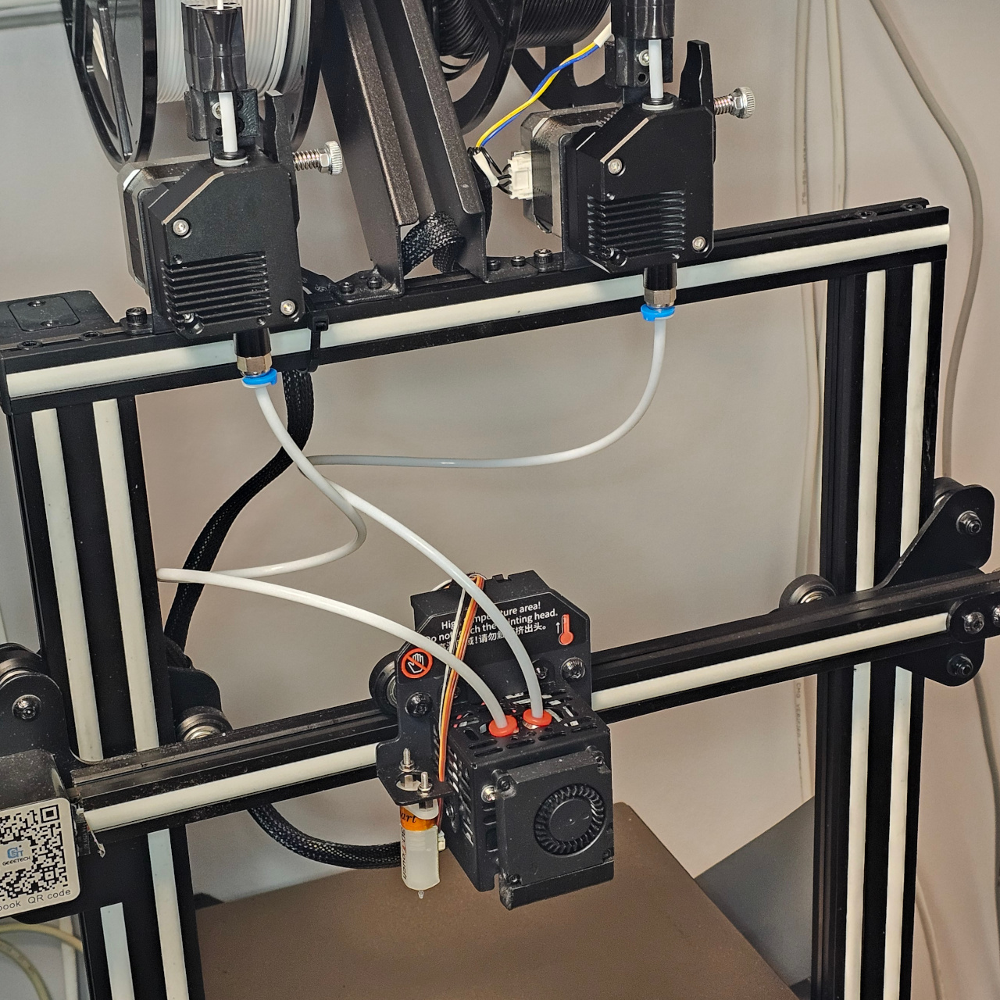
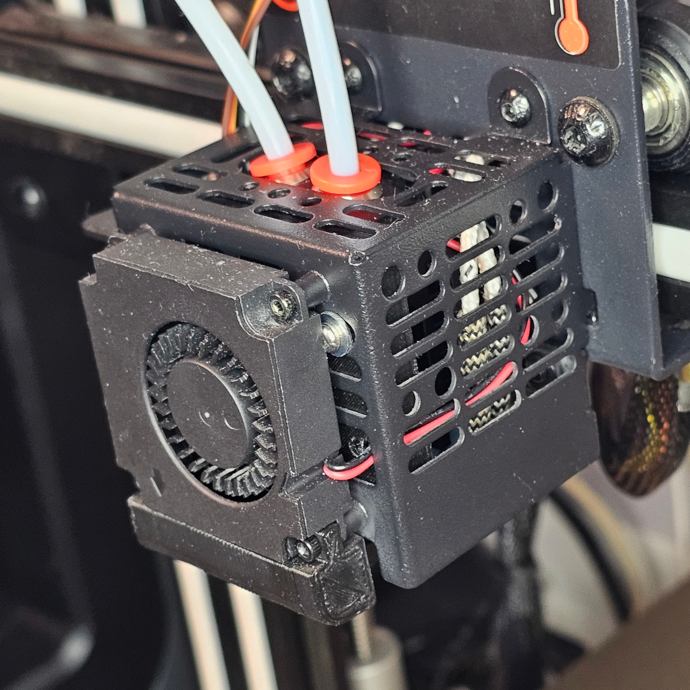

# Geeetech A20M Modded

I had a ton of problems with my Geeetech A20M when printing PETG. Bad quality prints, Fillamnt stick on the nozzle, Hotend clogs, Print not sticking to build plate, and so on. Therefore I decide to rebuild it to better fit my needs. After these changes it feels like a whole new printer! This is not a complet guide but if you are a tinker it should be enough to get you going. If you like this feel free to use the sponsored links below to support me! 

Donation using [Ko-Fi](https://ko-fi.com/patriksretrotech) or [PayPal](https://www.paypal.com/donate/?business=UCTJFD6L7UYFL&no_recurring=0&item_name=Please+support+me%21&currency_code=SEK) are highly appreciated!

 

Parts (AliExpress):\
[XCR3D 2 IN 1 OUT Hotend with Heater and Sensor](https://s.click.aliexpress.com/e/_c3dWIA2b)\
[BMG Extruders Full Metal (2x Right)](https://s.click.aliexpress.com/e/_c3lZYPxh)\
[Trianglelab 3D Touch](https://s.click.aliexpress.com/e/_c2QazP8F) + [Short cable with dupont connector](https://s.click.aliexpress.com/e/_c3YiJ9rv)\
[PEI Build Plate with magnetic base](https://s.click.aliexpress.com/e/_c3RffY35)

 

To mount the new Hotend a [mounting plate](Hotend/hotend_mount.stl) needs to be printed. 

Wiring of hotend\
 

For the modifications a custom config of [Marlin 2.0 firmware](Marlin/) is needed.\
Build it with [Visual Studio Code](https://code.visualstudio.com/download) using the [Auto Build Marlin](https://marlinfw.org/docs/basics/auto_build_marlin.html) extension to build and flash the firmware.

**IMPORTANT!** Do these steps BEFORE trying to do any prints:
1. Z-offset needs to be set correctly.
2. Run auto bed leveling.
3. Do first layer calibration.
4. Use the calibration in OrcaSlicer to fine tune your settings.

I use OrcaSlicer with the these settings: [Exported Settings](OrcaSlicer/)

I also run a Raspberry Pi with Octopi. This is convenient as you can upload print directly from OrcaSlice without fiddeling with SD Cards. I have added a realy on the cords to the printer so I can start it remotely. \
Install Octopi with Raspberry Pi Imager and load [config backup](Octopi/) (User/Password: octopi/octopi).

I strongly recommand buying a simple a fillamnt dryer. I was sceptical but this gives a huge improvement in the print results with smoother surfaces! I use a [Sunlu S2 Filament Dryer](https://s.click.aliexpress.com/e/_c3yCW3Xv)

XCR3D 2 In 1 out hotend. Not mixing colors, but PEGT is not mixing well anyway and I prefere clean colors.\

BMG Extruder with dual gears that ensure consisten feeding.\

