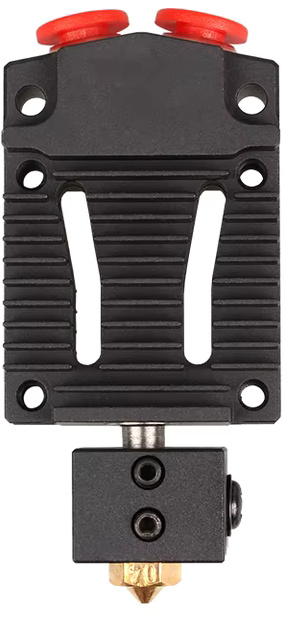

# Geeetech A20M Modded

Please use the sponsored links below to supportme!

Parts:\
[XCR3D 2 IN 1 OUT Hotend with Heater and Sensor](https://s.click.aliexpress.com/e/_c3dWIA2b)\
[BMG Extruders Full Metal (2x Right)](https://s.click.aliexpress.com/e/_c3lZYPxh)\
[3D Touch](https://s.click.aliexpress.com/e/_c2QazP8F) + [Short cable with dupont connector](https://s.click.aliexpress.com/e/_c3vGqBtl)\
[PEI Build Plate with magnetic base](https://s.click.aliexpress.com/e/_c3RffY35)\

To mount the new Hotend a [mounting plate](Hotend/hotend_mount.stl) needs to be printed.

To support these modifications a custom config of [Marlin 2.0 firmware](Marlin/) is needed.\
Build it with [Visual Studio Code](https://code.visualstudio.com/download) using the [Auto Build Marlin](https://marlinfw.org/docs/basics/auto_build_marlin.html) extension to build and flash the firmware.\

IMPORTANT steps BEFORE trying to do any prints:
1. Z-offset needs to be set correctly.
2. Run auto bed leveling.
3. Do first layer calibration.
4. Use the calibration in OrcaSlicer to fine tune your settings.

I use OrcaSlicer with the these settings: [Exported Settings](OrcaSlicer/)

I also run a Raspberry Pi with Octopi with a realy for the PSU.\
Install Octopi with Raspberry Pi Imager and load [config backup](Octopi/) (User/Password: octopi/octopi).

I strongly recommand using a fillamnt dryer! I use:\
[Sunlu S2 Filament Dryer](https://s.click.aliexpress.com/e/_c3yCW3Xv)

XCR3D 2 In 1 out hotend\

BMG Extruder\
